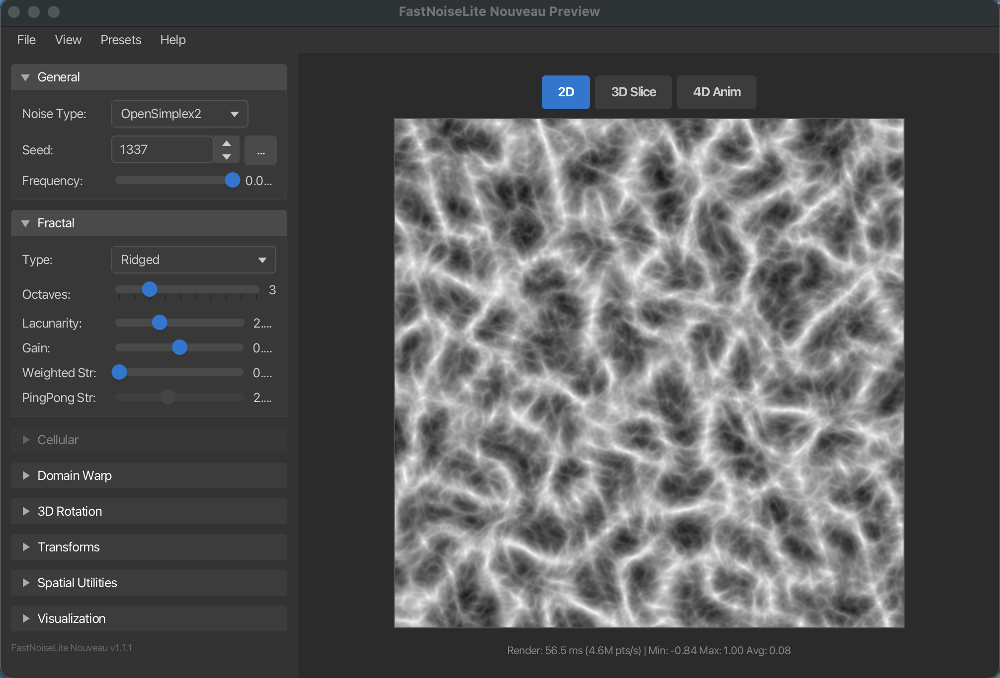

# FastNoiseLite Nouveau

A modular Java refactoring of [FastNoiseLite](https://github.com/Auburn/FastNoiseLite) with significant extensions for procedural content generation at astronomical scales.
The original was a 2600-line library with little in code documentation, and this refactoring aims to improve maintainability, performance, and usability. It also includes a comprehensive guide for using the library. I needed additional noise generators and algorithms for my own projects.
I still have to push this to Maven Central, but you can use it directly from GitHub.

## Background

This library was developed for the **TRIPS (Terran Republic Interstellar Plotting System)** application, a 3D interstellar visualization and exploration tool. The original FastNoiseLite provided an excellent foundation, but TRIPS required additional capabilities for:

- **Procedural planet generation** - Creating realistic terrain, atmospheres, and surface features for explorable worlds
- **Interstellar-scale nebulae** - Rendering gas clouds spanning light-years with proper curl-based particle motion
- **Astronomical coordinate precision** - Working with coordinates at scales of billions of units without floating-point degradation
- **Real-time LOD systems** - Dynamically adjusting detail levels as users navigate from galaxy-scale views down to planetary surfaces

These requirements led to the extensions documented below, which add 4D noise, spatial utilities for infinite worlds, analytical derivatives for lighting, and advanced algorithms like curl noise for fluid-like motion.

## Preview Tool

An interactive JavaFX preview tool is included for exploring and visualizing all noise types and features in real-time.



### Running the Preview Tool

```bash
# Using the run script (recommended)
./run-preview.sh

# Or manually
export JAVA_HOME=$(/usr/libexec/java_home -v 25)
mvn -pl preview-tool javafx:run
```

**Requirements:** JDK 25 with JavaFX 25 (preview tool only; library works with Java 17+)

### UI Overview

The preview tool has a dark-themed interface with:

- **Left Sidebar** - Collapsible settings panels for all noise parameters
- **Center Canvas** - Real-time noise preview (512x512 default, resizable)
- **Mode Tabs** - Switch between 2D, 3D Slice, and 4D Animation views
- **Stats Bar** - Render time, throughput, and min/max/avg noise values

### Settings Panels

| Panel | Description |
|-------|-------------|
| **General** | Noise type, seed, frequency |
| **Fractal** | Fractal type, octaves, lacunarity, gain, weighted strength, ping-pong strength |
| **Cellular** | Distance function, return type, jitter (only enabled for Cellular noise) |
| **Domain Warp** | Enable/disable, warp type, amplitude |
| **3D Rotation** | Rotation type for reducing directional artifacts |
| **Transforms** | Build a pipeline of post-processing transforms (Ridge, Terrace, Power, Clamp, etc.) |
| **Spatial Utilities** | Preview Chunked, Tiled, LOD, and other spatial modes |
| **Visualization** | Color gradient selection (Grayscale, Terrain, Heat, Ocean, Custom) |

### Visualization Modes

- **2D** - Standard heightmap view
- **3D Slice** - Navigate through a 3D noise volume using the Z slider
- **4D Anim** - Animate through the W dimension with play/pause and speed controls

### Interaction

- **Pan** - Click and drag to move the view
- **Zoom** - Scroll wheel to zoom in/out
- **Reset** - Double-click to reset view to origin

### Menu Options

- **File → Export PNG** - Save the current noise image
- **File → Copy Code Snippet** - Copy Java code to recreate the current configuration
- **View → Canvas Size** - Change preview resolution (256, 512, 1024, or custom)
- **Presets** - Quick configurations for Terrain, Clouds, Marble, Wood Grain, and Cells/Voronoi

## Samples

Interactive JavaFX sample applications demonstrating real-world usage of the noise library.

### Running the Samples

```bash
# Using the run script (recommended)
./run-samples.sh

# Or manually
export JAVA_HOME=$(/usr/libexec/java_home -v 25)
mvn -pl samples javafx:run
```

### Available Samples

#### Multi-Biome Terrain Generator

Demonstrates layered terrain composition using the Node Graph System:

- **Continental Layer** - Low frequency FBm with domain warping for organic coastlines
- **Mountain Layer** - Ridged noise masked to appear only on highlands
- **Hills Layer** - Medium frequency FBm for rolling terrain variation
- **Detail Layer** - High frequency noise for fine surface features

**Features:**
- Real-time terrain visualization with 8 distinct biomes
- Adjustable parameters (seed, scales, warp amplitude)
- Layer visualization modes to understand composition
- Pan and zoom navigation

**Biomes:** Deep Ocean, Shallow Ocean, Beach, Plains, Forest, Hills, Mountains, Snow Peaks

#### 3D Mountain Terrain

Realistic 3D mountain visualization inspired by FastNoise2's NoiseTool:

- **Ridged Multifractal** - Sharp alpine peaks and ridges
- **Hybrid Multifractal** - Erosion-like detail distribution
- **Domain Warping** - Organic, non-uniform mountain ranges
- **Multi-octave Detail** - Features at all scales from peaks to pebbles

**Features:**
- Real-time 3D mesh rendering with lighting
- Orbital camera (drag to rotate, scroll to zoom)
- 256×256 triangle mesh (130,050 triangles)
- Adjustable terrain parameters
- Wireframe mode for mesh visualization

## Roadmap

Planned features for future releases:

- [x] **Noise Preview Tool** - Interactive visualizer to explore noise generator combinations, tweak parameters in real-time, and see the resulting patterns (heightmaps, textures, 3D volumes)
- [x] **Performance Benchmarks** - Comprehensive benchmarking suite similar to the original FastNoiseLite, comparing noise types, fractal modes, and extension algorithms across different scenarios
- [x] **Node Graph System** - FastNoise2-inspired composable noise generation with fluent API, immutable nodes, and bulk evaluation support

## Benchmarks

Run benchmarks with:
```bash
mvn compile test-compile exec:java
```

Example results (Apple M4 Max, 128GB unified memory, Java 17):

### Core Noise Types

| 2D Noise Type | M points/s | 3D Noise Type | M points/s |
|---------------|------------|---------------|------------|
| Value | 1110.56 | Value | 153.87 |
| ValueCubic | 254.71 | ValueCubic | 15.28 |
| Perlin | 369.91 | Perlin | 61.85 |
| OpenSimplex2 | 285.83 | OpenSimplex2 | 74.41 |
| OpenSimplex2S | 225.19 | OpenSimplex2S | 61.46 |
| Cellular | 119.86 | Cellular | 17.89 |

**4D Simplex [EXT]:** 63.59 M points/s

### Fractal Noise (3D, 4 octaves)

| Fractal Type | M points/s |
|--------------|------------|
| FBm | 14.40 |
| Ridged | 13.82 |
| PingPong | 13.61 |
| Billow [EXT] | 13.50 |
| HybridMulti [EXT] | 14.48 |

### Spatial Utilities [EXT]

| Utility | M points/s |
|---------|------------|
| ChunkedNoise | 195.82 |
| DoublePrecision | 230.93 |
| TiledNoise | 67.75 |
| LODNoise | 101.64 |

### Advanced Algorithms [EXT]

| Algorithm | M points/s |
|-----------|------------|
| WaveletNoise 2D | 135.65 |
| SparseConvolution | 7.54 |
| HierarchicalNoise | 48.73 |
| Curl3D | 6.41 |
| CurlFBm3D (4 oct) | 1.99 |

### Noise Derivatives [EXT]

| Derivative Type | M points/s |
|-----------------|------------|
| Analytical 2D | 225.01 |
| Numerical 2D | 57.92 |
| Analytical 3D | 61.77 |
| Numerical 3D | 11.50 |

### Domain Warp

| Warp Type | M points/s |
|-----------|------------|
| OpenSimplex2 2D | 263.44 |
| OpenSimplex2 3D | 53.72 |
| Progressive 2D (4 oct) | 31.91 |

## Features

### Original FastNoiseLite Features
- Multiple noise types (OpenSimplex2, Perlin, Cellular/Voronoi, Value)
- Fractal noise combining (FBm, Ridged, PingPong)
- Domain warping for organic distortion
- Deterministic output (same seed = same results)
- Fast performance suitable for real-time applications

### Extensions for TRIPS

| Feature | Description | Use Case |
|---------|-------------|----------|
| **4D Simplex Noise** | Full 4D noise with fractal support | Animated volumetrics, looping effects |
| **Double Precision** | Coordinates at astronomical scales | Interstellar distances (10^15 units) |
| **Chunked Noise** | Infinite worlds without precision loss | Seamless galaxy-scale exploration |
| **LOD Noise** | Distance-based octave reduction | Performance optimization for distant objects |
| **Tiled Noise** | Seamlessly tileable textures | Planetary surface textures |
| **Curl Noise** | Divergence-free flow fields | Nebula particle systems, atmospheres |
| **Noise Derivatives** | Analytical gradients and normal maps | Terrain lighting, bump mapping |
| **Billow/HybridMulti** | Additional fractal types | Clouds, eroded terrain |
| **Noise Transforms** | Post-processing pipeline | Ridge enhancement, terracing, quantization |
| **Wavelet Noise** | Band-limited, mipmap-safe noise | Texture synthesis without aliasing |
| **Node Graph System** | Composable DAG-based noise generation | Complex multi-layer terrain, procedural textures |

## Quick Start

### Maven Dependency

```xml
<dependency>
    <groupId>com.cognitivedynamics</groupId>
    <artifactId>fastnoiselitenouveau</artifactId>
    <version>1.1.1</version>
</dependency>
```

### Basic Usage

```java
import com.cognitivedynamics.noisegen.FastNoiseLite;

// Create noise generator with seed
FastNoiseLite noise = new FastNoiseLite(1337);

// Configure for terrain
noise.SetNoiseType(FastNoiseLite.NoiseType.OpenSimplex2);
noise.SetFractalType(FastNoiseLite.FractalType.FBm);
noise.SetFractalOctaves(6);
noise.SetFrequency(0.005f);

// Generate noise
float value2D = noise.GetNoise(x, y);
float value3D = noise.GetNoise(x, y, z);
float value4D = noise.GetNoise(x, y, z, time);  // [EXT] 4D support
```

### Astronomical-Scale Coordinates

```java
import com.cognitivedynamics.noisegen.spatial.DoublePrecisionNoise;

FastNoiseLite base = new FastNoiseLite(1337);
DoublePrecisionNoise precise = new DoublePrecisionNoise(base);

// Works at interstellar distances
double x = 1_000_000_000_000.5;  // 1 trillion + 0.5
double y = 2_500_000_000_000.3;
float value = precise.getNoise(x, y);  // Precise to the decimal
```

### Nebula Particle Motion with Curl Noise

```java
import com.cognitivedynamics.noisegen.spatial.TurbulenceNoise;

FastNoiseLite base = new FastNoiseLite(1337);
TurbulenceNoise turbulence = new TurbulenceNoise(base);
turbulence.setFrequency(0.001f);  // Large-scale swirls

// Get divergence-free velocity for particle advection
float[] velocity = turbulence.curl3D(x, y, z);
// Particles following this field won't bunch up or disperse
```

## Build

```bash
mvn clean compile    # Compile
mvn test             # Run all tests (697 tests)
mvn package          # Build JAR
mvn install          # Install to local repo (needed for preview-tool)
```

**Note:** This is a multi-module Maven project:
- `noisegen-lib` - The core noise library (Java 17+)
- `preview-tool` - The JavaFX preview application (Java 25+)
- `samples` - Sample applications demonstrating real-world usage (Java 25+)

To build only the library:
```bash
mvn -pl noisegen-lib package
```

Library requires Java 17+. Preview tool and samples require JDK 25 with JavaFX 25.

---

## Comprehensive Guide

### Table of Contents

1. [Noise Types](#noise-types)
2. [Fractal Noise](#fractal-noise)
3. [Domain Warp](#domain-warp)
4. [4D Noise](#4d-noise)
5. [Noise Transforms](#noise-transforms)
6. [Spatial Utilities](#spatial-utilities)
7. [Advanced Algorithms](#advanced-algorithms)
8. [Noise Derivatives](#noise-derivatives)
9. [Node Graph System](#node-graph-system)
10. [Configuration Reference](#configuration-reference)
11. [Package Structure](#package-structure)

---

## Cheat Sheet: What To Use When

| Goal | Primary Tool / Class | Key Setting / Method |
|------|---------------------|----------------------|
| **Smooth terrain / clouds** | OpenSimplex2 + FBm | `SetFractalOctaves(5-8)` |
| **Sharp ridges / mountains** | Ridged or Billow | `SetFractalType(Ridged)` |
| **Soft puffy clouds** | Billow fractal | `SetFractalType(Billow)` |
| **Eroded terrain** | HybridMulti | `SetFractalType(HybridMulti)` |
| **Mesa / plateau steps** | TerraceTransform | `TerraceTransform.contours(8)` |
| **Animated volumetrics** | 4D noise | `GetNoise(x, y, z, time)` |
| **Looping animations** | TiledNoise (4D torus) | `tiled.getNoise(x, y, z, time)` |
| **Infinite world, huge coords** | ChunkedNoise | `new ChunkedNoise(base, 1024)` |
| **Astronomical distances** | DoublePrecisionNoise | `precise.getNoise(1e12, 2e12)` |
| **Distant detail optimization** | LODNoise | `lod.getNoise(x, y, distance)` |
| **Tileable planetary textures** | TiledNoise | `tiled.getSeamlessImage(1024, 1024)` |
| **Realistic lighting / bumps** | NoiseDerivatives | `deriv.computeNormal2D(x, y, scale)` |
| **Normal map textures** | NoiseDerivatives | `deriv.generateNormalMapRGB(...)` |
| **Nebula filaments** | Ridged + curl noise | `turbulence.curl3D(x, y, z)` |
| **Fluid / smoke motion** | TurbulenceNoise | `turbulence.curlFBm3D(...)` |
| **Voronoi cells / cracks** | Cellular noise | `SetNoiseType(Cellular)` |
| **Organic biome boundaries** | Cellular + Domain Warp | `DomainWarp()` → `Cellular` |
| **Complex layered terrain** | Node Graph System | `graph.fbm().add(graph.ridged())` |
| **Composable noise pipelines** | NoiseGraph + fluent API | `node.scale().clamp().warp()` |
| **Bulk heightmap generation** | BulkEvaluator | `bulk.fill2D(node, 512, 512, ...)` |

---

## Noise Types

### OpenSimplex2 (Default)

The recommended general-purpose noise. Produces smooth, natural-looking patterns.

```java
noise.SetNoiseType(FastNoiseLite.NoiseType.OpenSimplex2);
```

**Best for:** Terrain, clouds, general procedural textures

### OpenSimplex2S

A smoother variant with slightly different characteristics.

```java
noise.SetNoiseType(FastNoiseLite.NoiseType.OpenSimplex2S);
```

### Perlin

Classic Perlin noise with a slightly different visual character.

```java
noise.SetNoiseType(FastNoiseLite.NoiseType.Perlin);
```

### Cellular (Voronoi)

Creates cell-like patterns based on distance to random points.

```java
noise.SetNoiseType(FastNoiseLite.NoiseType.Cellular);
noise.SetCellularDistanceFunction(FastNoiseLite.CellularDistanceFunction.Euclidean);
noise.SetCellularReturnType(FastNoiseLite.CellularReturnType.Distance);
noise.SetCellularJitter(1.0f);
```

**Best for:** Stone textures, biological patterns, cracked surfaces

### Value / ValueCubic

Simple value noise using interpolated random values at grid points.

```java
noise.SetNoiseType(FastNoiseLite.NoiseType.Value);
noise.SetNoiseType(FastNoiseLite.NoiseType.ValueCubic);  // Smoother
```

---

## Fractal Noise

Fractal noise combines multiple octaves at different frequencies for more natural patterns.

### FBm (Fractional Brownian Motion)

```java
noise.SetFractalType(FastNoiseLite.FractalType.FBm);
noise.SetFractalOctaves(4);
noise.SetFractalLacunarity(2.0f);
noise.SetFractalGain(0.5f);
```

### Ridged

Creates ridge-like patterns for mountains and veins.

```java
noise.SetFractalType(FastNoiseLite.FractalType.Ridged);
```

### PingPong

Creates banded, terraced patterns.

```java
noise.SetFractalType(FastNoiseLite.FractalType.PingPong);
noise.SetFractalPingPongStrength(2.0f);
```

### Billow *(Extension)*

Soft, cloud-like patterns - the inverse of ridged.

```java
noise.SetFractalType(FastNoiseLite.FractalType.Billow);
```

### Hybrid Multifractal *(Extension)*

Multiplicative/additive blend where flat areas stay flat but detailed areas get more detail.

```java
noise.SetFractalType(FastNoiseLite.FractalType.HybridMulti);
```

**Best for:** Realistic terrain, erosion-like detail distribution

---

## Domain Warp

Domain warping distorts input coordinates before sampling, creating organic patterns.

```java
FastNoiseLite noise = new FastNoiseLite(1337);
noise.SetDomainWarpType(FastNoiseLite.DomainWarpType.OpenSimplex2);
noise.SetDomainWarpAmp(30.0f);

Vector2 coord = new Vector2(x, y);
noise.DomainWarp(coord);
float value = noise.GetNoise(coord.x, coord.y);
```

---

## 4D Noise

*(Extension)* - 4D noise adds a fourth dimension, typically used for time-based animations.

```java
// Animated 3D noise
float value = noise.GetNoise(x, y, z, time * 0.5f);

// Looping animation (circular path through 4D)
float angle = progress * 2.0f * (float) Math.PI;
float w = (float) Math.sin(angle) * loopRadius;
float extraDim = (float) Math.cos(angle) * loopRadius;
float looping = noise.GetNoise(x, y, z + extraDim, w);
```

---

## Noise Transforms

*(Extension)* - Post-processing transforms for noise values.

```java
import com.cognitivedynamics.noisegen.transforms.*;

// Range remapping
NoiseTransform normalize = new RangeTransform(-1f, 1f, 0f, 1f);

// Power curves
NoiseTransform sharp = new PowerTransform(2.0f);

// Ridge patterns
NoiseTransform ridges = new RidgeTransform();

// Terracing
NoiseTransform terrace = new TerraceTransform(8);

// Chain multiple transforms
ChainedTransform pipeline = new ChainedTransform(
    new RidgeTransform(),
    new PowerTransform(2.0f),
    new RangeTransform(0f, 1f, 0f, 255f)
);
float result = pipeline.apply(noiseValue);
```

---

## Spatial Utilities

*(Extension)* - Utilities for large-scale or specialized coordinate systems.

### ChunkedNoise

Handles infinite worlds without float precision degradation.

```java
ChunkedNoise chunked = new ChunkedNoise(baseNoise, 1000.0);
float value = chunked.getNoise(1_000_000_000.0, 2_500_000_000.0);
```

### LODNoise

Automatically reduces octaves based on distance.

```java
LODNoise lod = new LODNoise(baseNoise, 8);
float nearValue = lod.getNoise(x, y, 0.0f);    // Full detail
float farValue = lod.getNoise(x, y, 500.0f);   // Reduced detail
```

### TiledNoise

Creates seamlessly tileable noise for textures.

```java
TiledNoise tiled = new TiledNoise(baseNoise, 256, 256);
float v1 = tiled.getNoise(0, 128);    // Left edge
float v2 = tiled.getNoise(256, 128);  // Right edge (equals v1)

// Generate seamless image
byte[] grayscale = tiled.getSeamlessImage(256, 256);
byte[] terrain = tiled.getSeamlessImageRGB(256, 256, TiledNoise.TERRAIN_GRADIENT);
```

### DoublePrecisionNoise

Double-precision coordinates for astronomical scales.

```java
DoublePrecisionNoise precise = new DoublePrecisionNoise(baseNoise);
float value = precise.getNoise(1_000_000_000_000.5, 2_500_000_000_000.3);
```

---

## Advanced Algorithms

*(Extension)* - Specialized algorithms for demanding use cases.

### TurbulenceNoise (Curl Noise)

Divergence-free flow fields for fluid-like motion.

```java
TurbulenceNoise turbulence = new TurbulenceNoise(baseNoise);

// Curl noise for particle advection
float[] velocity = turbulence.curl3D(x, y, z);

// Multi-octave curl
float[] curlFBm = turbulence.curlFBm3D(x, y, z, 4);
```

**Best for:** Nebula visualization, smoke/fire effects, atmospheric particles

### WaveletNoiseGen

Band-limited noise for clean mipmapping.

```java
WaveletNoiseGen wavelet = new WaveletNoiseGen(1337, 128);
float fbm = wavelet.sampleFBm2D(x, y, 4, 2.0f, 0.5f);
```

### HierarchicalNoise

Quadtree/octree-based adaptive sampling.

```java
HierarchicalNoise hier = new HierarchicalNoise(baseNoise, 8);
float coarse = hier.sampleLevel(x, y, 0);  // Continents
float fine = hier.sampleLevel(x, y, 7);    // Pebbles
float adaptive = hier.sampleAdaptive(x, y, viewScale);
```

### SparseConvolutionNoise

Memory-efficient noise with constant memory regardless of world size.

```java
SparseConvolutionNoise sparse = new SparseConvolutionNoise(1337);
float value = sparse.getNoise(x, y);
```

---

## Noise Derivatives

*(Extension)* - Analytical gradients for lighting and normal maps.

```java
import com.cognitivedynamics.noisegen.derivatives.NoiseDerivatives;

NoiseDerivatives deriv = new NoiseDerivatives(noise);

// Get noise value and gradient together
NoiseDerivatives.NoiseWithGradient2D result = deriv.getNoiseWithGradient2D(x, y);
float value = result.value;
float dx = result.dx;
float dy = result.dy;

// Compute surface normal for terrain lighting
float[] normal = deriv.computeNormal2D(x, y, heightScale);

// Generate normal map texture
byte[] normalMap = deriv.generateNormalMapRGB(width, height, worldSize, heightScale);
```

---

## Node Graph System

*(Extension)* - A FastNoise2-inspired composable noise generation system using a directed acyclic graph (DAG) of nodes.

### Overview

The node graph system provides a fluent API for building complex noise configurations by chaining nodes together. All nodes are immutable and thread-safe, using double-precision coordinates for astronomical scales.

### Quick Start

```java
import com.cognitivedynamics.noisegen.graph.NoiseGraph;
import com.cognitivedynamics.noisegen.graph.NoiseNode;
import com.cognitivedynamics.noisegen.graph.util.BulkEvaluator;

// Create a graph factory
NoiseGraph graph = NoiseGraph.create(1337);

// Build complex terrain with fluent API
NoiseNode terrain = graph.fbm(graph.simplex().frequency(0.01), 5)
    .add(graph.ridged(graph.simplex().frequency(0.02), 4).multiply(0.3))
    .clamp(-1.0, 1.0);

// Single point evaluation
double height = terrain.evaluate2D(1337, 100.0, 200.0);

// Bulk evaluation for heightmaps
BulkEvaluator bulk = new BulkEvaluator(1337);
double[][] heightmap = bulk.fill2D(terrain, 512, 512, 0, 0, 1.0);
```

### Node Types

#### Source Nodes
Generate base noise values:

```java
graph.simplex()           // OpenSimplex2 noise
graph.simplexSmooth()     // OpenSimplex2S (smoother variant)
graph.perlin()            // Classic Perlin noise
graph.value()             // Value noise
graph.valueCubic()        // Value noise with cubic interpolation
graph.cellular()          // Cellular/Voronoi noise
graph.simplex4D()         // 4D Simplex (supports W dimension)
graph.constant(0.5)       // Constant value
```

All source nodes support `.frequency(double)` for scaling:
```java
graph.simplex().frequency(0.01)  // Low frequency = large features
```

#### Fractal Nodes
Combine multiple octaves:

```java
graph.fbm(source, octaves)              // Fractional Brownian motion
graph.ridged(source, octaves)           // Ridged multifractal (mountains)
graph.billow(source, octaves)           // Billow (soft clouds)
graph.hybridMulti(source, octaves)      // Hybrid (erosion-like detail)

// With custom lacunarity and gain
graph.fbm(source, 5, 2.0, 0.5)
```

#### Combiner Nodes
Combine two noise sources:

```java
node.add(other)           // Sum: a + b
node.subtract(other)      // Difference: a - b
node.multiply(other)      // Product: a * b
node.multiply(0.5)        // Scale by constant
node.min(other)           // Minimum: min(a, b)
node.max(other)           // Maximum: max(a, b)

// Blend between two sources using control signal
graph.blend(nodeA, nodeB, controlNode)  // lerp(a, b, control)
```

#### Modifier Nodes
Transform coordinates or values:

```java
node.scale(2.0)                    // Scale coordinates (higher frequency)
node.offset(10, 20, 0)             // Offset coordinates
node.clamp(-0.5, 0.5)              // Clamp output range
node.abs()                         // Absolute value
node.invert()                      // Negate: -value
node.transform(noiseTransform)     // Apply any NoiseTransform
```

#### Domain Warp
Distort coordinates using noise:

```java
NoiseNode warped = terrain.warp(graph.simplex().frequency(0.005), 50.0);
// warpSource provides distortion, amplitude controls strength
```

### Complex Examples

#### Layered Terrain with Biomes

```java
NoiseGraph g = NoiseGraph.create(1337);

// Plains biome - smooth rolling hills
NoiseNode plains = g.fbm(g.simplex().frequency(0.01), 3)
    .multiply(0.3);

// Mountain biome - dramatic ridges
NoiseNode mountains = g.ridged(g.simplex().frequency(0.02), 5)
    .multiply(1.5);

// Biome selector (0 = plains, 1 = mountains)
NoiseNode biomeControl = g.simplex().frequency(0.001)
    .clamp(-1, 1)
    .multiply(0.5)
    .add(g.constant(0.5));  // Map to [0, 1]

// Blend based on biome
NoiseNode terrain = g.blend(plains, mountains, biomeControl);
```

#### Animated Clouds (4D)

```java
NoiseNode clouds = graph.fbm(graph.simplex4D().frequency(0.05), 4);

// Animate by varying W coordinate
for (double time = 0; time < 10; time += 0.1) {
    double density = clouds.evaluate4D(seed, x, y, z, time);
}
```

#### Domain-Warped Terrain

```java
NoiseNode warpSource = graph.simplex().frequency(0.005);
NoiseNode terrain = graph.fbm(graph.simplex().frequency(0.01), 4)
    .warp(warpSource, 50.0)  // Organic distortion
    .clamp(-1, 1);
```

### BulkEvaluator

Efficiently fill arrays with noise values:

```java
BulkEvaluator bulk = new BulkEvaluator(seed);

// 2D heightmap
double[][] map2D = bulk.fill2D(node, width, height, startX, startY, step);

// 2D with explicit range
double[][] rangeMap = bulk.fill2DRange(node, width, height, minX, minY, maxX, maxY);

// 3D volume
double[][][] volume = bulk.fill3D(node, width, height, depth, startX, startY, startZ, step);

// Flat arrays for performance
double[] flat2D = bulk.fill2DFlat(node, width, height, startX, startY, step);
double[] flat3D = bulk.fill3DFlat(node, width, height, depth, startX, startY, startZ, step);

// Float arrays for graphics APIs
float[][] floatMap = bulk.fill2DFloat(node, width, height, startX, startY, step);
```

### Thread Safety

All nodes are immutable and thread-safe:
- Fluent methods return new node instances
- Same node can be evaluated from multiple threads
- BulkEvaluator instances are thread-safe

```java
NoiseNode terrain = graph.fbm(graph.simplex(), 4);

// Safe to use from multiple threads
ExecutorService executor = Executors.newFixedThreadPool(8);
for (int i = 0; i < 8; i++) {
    executor.submit(() -> terrain.evaluate2D(seed, x, y));
}
```

### Integration with Existing Code

The node graph system integrates with existing FastNoiseLite features:

```java
// Use existing transforms
import com.cognitivedynamics.noisegen.transforms.RangeTransform;

NoiseNode normalized = graph.simplex()
    .transform(new RangeTransform(-1, 1, 0, 255));

// Use existing cellular settings
import com.cognitivedynamics.noisegen.NoiseTypes.*;

NoiseNode cells = graph.cellular(
    CellularDistanceFunction.Euclidean,
    CellularReturnType.Distance2Sub,
    1.0
);
```

---

## Configuration Reference

### Frequency Guidelines

| Scale | Frequency | Use Case |
|-------|-----------|----------|
| Continent | 0.001 - 0.003 | Large landmasses |
| Region | 0.003 - 0.01 | Mountain ranges, biomes |
| Local | 0.01 - 0.05 | Hills, forests |
| Detail | 0.05 - 0.2 | Rocks, grass |
| Fine | 0.2 - 1.0 | Textures, small details |

---

## Package Structure

```
fastnoiselitenouveau/
├── pom.xml                      # Parent POM (multi-module)
├── noisegen-lib/                # Core noise library
│   ├── pom.xml
│   └── src/main/Java/com/cognitivedynamics/noisegen/
│       ├── FastNoiseLite.java       # Main facade (use this!)
│       ├── NoiseConfig.java         # Configuration holder
│       ├── NoiseTypes.java          # Enum definitions
│       ├── Vector2.java, Vector3.java
│       ├── generators/
│       │   ├── NoiseGenerator.java      # Interface
│       │   ├── SimplexNoiseGen.java     # OpenSimplex2/2S
│       │   ├── Simplex4DNoiseGen.java   # [EXT] 4D Simplex
│       │   ├── WaveletNoiseGen.java     # [EXT] Band-limited
│       │   ├── CellularNoiseGen.java    # Voronoi
│       │   ├── PerlinNoiseGen.java      # Classic Perlin
│       │   └── ValueNoiseGen.java       # Value/ValueCubic
│       ├── fractal/
│       │   └── FractalProcessor.java    # FBm, Ridged, PingPong, Billow, HybridMulti
│       ├── transforms/                   # [EXT]
│       │   ├── NoiseTransform.java, RangeTransform.java, PowerTransform.java
│       │   ├── RidgeTransform.java, TurbulenceTransform.java, ClampTransform.java
│       │   ├── InvertTransform.java, ChainedTransform.java
│       │   ├── TerraceTransform.java, QuantizeTransform.java
│       ├── spatial/                      # [EXT]
│       │   ├── ChunkedNoise.java, LODNoise.java, TiledNoise.java
│       │   ├── DoublePrecisionNoise.java, SparseConvolutionNoise.java
│       │   ├── HierarchicalNoise.java, TurbulenceNoise.java
│       ├── derivatives/                  # [EXT]
│       │   ├── NoiseDerivatives.java, SimplexDerivatives.java
│       ├── graph/                         # [EXT] Node Graph System
│       │   ├── NoiseNode.java            # Core interface
│       │   ├── NoiseGraph.java           # Factory/builder
│       │   ├── nodes/
│       │   │   ├── source/               # SimplexSourceNode, PerlinSourceNode, etc.
│       │   │   ├── combiner/             # AddNode, MultiplyNode, BlendNode, etc.
│       │   │   ├── modifier/             # ClampNode, DomainScaleNode, TransformNode, etc.
│       │   │   ├── fractal/              # FBmNode, RidgedNode, BillowNode, etc.
│       │   │   └── warp/                 # DomainWarpNode
│       │   └── util/
│       │       └── BulkEvaluator.java    # Bulk array filling
│       └── warp/
│           └── DomainWarpProcessor.java
├── preview-tool/                # JavaFX preview application
│   ├── pom.xml
│   └── src/main/java/com/cognitivedynamics/noisegen/preview/
│       ├── NoisePreviewApp.java     # Main JavaFX application
│       ├── MainController.java      # UI controller
│       ├── model/
│       │   └── NoisePreviewModel.java   # Observable settings model
│       ├── view/
│       │   ├── NoiseCanvas.java     # Noise rendering canvas
│       │   └── ControlPanel.java    # Settings sidebar
│       └── util/
│           └── NoiseRenderer.java   # Background rendering
└── samples/                     # Sample applications
    ├── pom.xml
    └── src/main/java/com/cognitivedynamics/noisegen/samples/
        ├── SamplesLauncher.java     # Main launcher for all samples
        ├── multibiome/
        │   ├── MultiBiomeApp.java       # JavaFX terrain visualizer
        │   ├── MultiBiomeTerrain.java   # Layered terrain using node graph
        │   ├── BiomeType.java           # Biome definitions and colors
        │   └── TerrainRenderer.java     # Canvas rendering utilities
        └── mountains/
            ├── MountainViewApp.java     # 3D mountain viewer
            ├── MountainTerrain.java     # Alpine terrain generation
            └── TerrainMeshBuilder.java  # Heightmap to 3D mesh conversion
```

---

## License

MIT License - See source files for full license text.

Based on [FastNoiseLite](https://github.com/Auburn/FastNoiseLite) by Jordan Peck.
